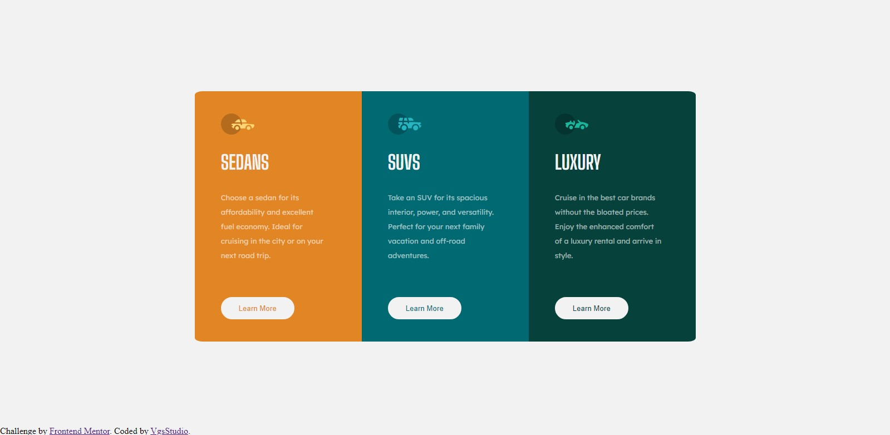
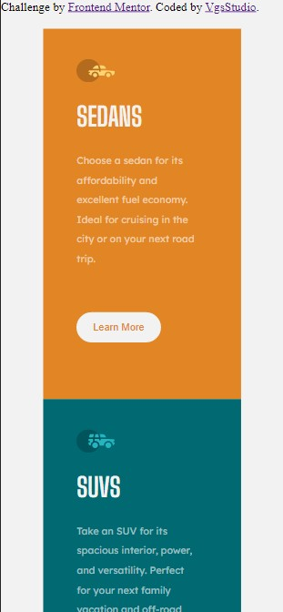

# Frontend Mentor - 3-column preview card component solution

This is a solution to the [3-column preview card component challenge on Frontend Mentor](https://www.frontendmentor.io/challenges/3column-preview-card-component-pH92eAR2-). Frontend Mentor challenges help you improve your coding skills by building realistic projects. 

## Overview
It was hard, but I'm getting there!

### The challenge

Users should be able to:

- View the optimal layout depending on their device's screen size
- See hover states for interactive elements

### Screenshot

<strong>Desktop</strong> version is ok:

<strong>Mobile</strong> version have some issues, but I don't now how to solve yet :

### Built with

- Semantic HTML5 markup
- CSS custom properties
- Flexbox
- CSS Grid

### What I learned

It was a fun way to pratice. I'm looking for learning more and more!

### Continued development

I will study HTML and CSS more, getting better everytime! In future you will see!
Next time I'm planning in start with mobile and then go to Desktop.

## Author

- Github - [@VgsStudio](https://github.com/VgsStudio)
- Frontend Mentor - [@VgsStudio](https://www.frontendmentor.io/profile/VgsStudio)
- Twitter - [@Vgs_Studio](https://www.twitter.com/Vgs_Studio)

## Inspiration

"Never gonna give you up" - Astley, Rick - 1987 
